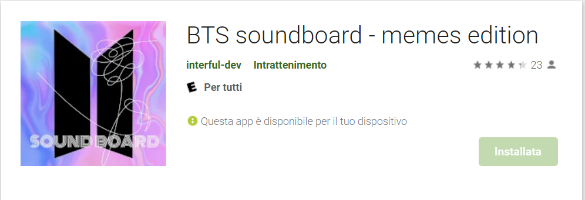
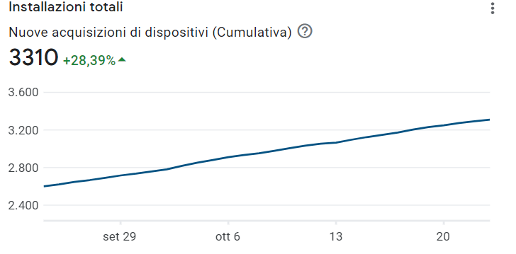

# BTS Soundboard - memes edition
## Flutter app

BTS soundboard is an open source app made while learning Flutter & Dart.You can contribute to it by adding new audios or even new features. After reviewed we'll update the app with the changes.

## Features

- BTS inside jokes & memes available in an unique soundboard.
- You can now manage your favourites audios.
- Make a choice with the 'magic BTS ball'.

## Tech

Dillinger uses a number of open source projects to work properly:

- [Flutter] - Flutter is Google's UI toolkit for building beautiful, natively compiled applications for mobile, web, desktop, and embedded devices from a single codebase.
- [Dart] - Dart is a client-optimized language for fast apps on any platform.

And of course BTS soundboard itself is open source with a public repo
 on GitHub.

## Media

## Downloads counter updated at 24/10/21

